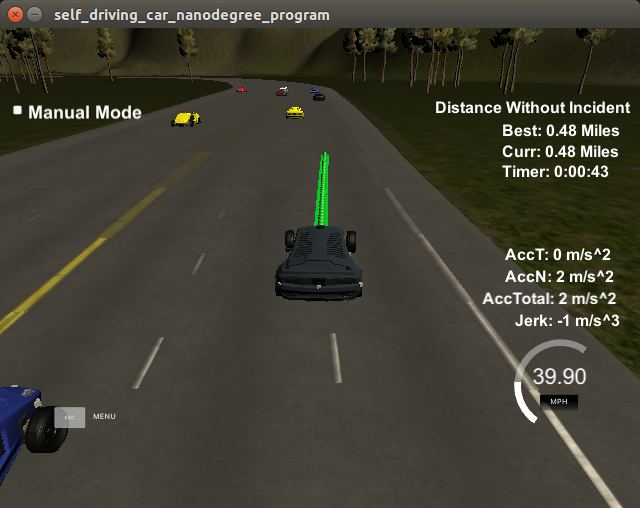
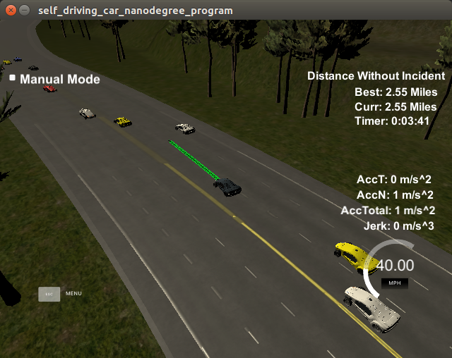

# CarND-Path-Planning-Project
Self-Driving Car Engineer Nanodegree Program


   
### Simulator.
This project uses the Term3 Simulator which contains the Path Planning Project from the [releases tab (https://github.com/udacity/self-driving-car-sim/releases/tag/T3_v1.2).

### Goals

In this project the goal was to safely navigate around a virtual highway with other traffic under the 50 MPH speed limit. The car is provided with localization and sensor fusion data, and a sparse map list of waypoints around the highway.

The car should tries to go as close as possible to the 50 MPH speed limit, changing lanes and avoid accidents. Human comfort dictates limitations of 10 m/s^2 on the acceleration & 10 m/s^3 on the jerk.

# Architecture

## Implemenation

A vehicle centric approach was implemented, such that the vehicle and its neighbors were modeled in the `Vehicle` class.

The main loop consists of
1. preprocessing

    - neighbors, safety distance, left over previous path analysis

2. target velocity 

    - set the reference velocity, with resepect to leading vehicle, such that absolute acceleration does not pass 10 m/s^2

    - no leading vehicle: increasing velocity with resepect to maximum acceleration and speed limit

    - leading vehicle further than the safety distance: 
        * set increasing velocity with resepect to maximum acceleration and speed limit. 
        * limit velocity by the distance-interpolated velocity between the speed limit and the leading vehicle's velocity. The motivation is to reach the safety distance with a speed not higher than the leading vehicle's velocity
    
    - leading vehicle closer than the safety distance
        * decelerate with respect to maximum allowed absolute acceleration

3. Cost-based lane selection

    - lane selection is based on the sum of multiple cost functions 
        
        * leading vehicle - exp(1 - lane_leading_distance / ref_dist), where ref distance is the current lane's leading car distance, or in its absence, the safety distance

        * change lane - penal transitions larger than 1

        * leading safety - set to max if leading car is within safety range, regardeless of its relative speed

        * trailing safety - set to max if trailing car is, not within the current lane and within one thrid of safety range, regardeless of its relative speed, or not within the current lane but is slower than the vehicle's speed

    - lane selection weights were tuned to allow proper 

4. trajectory generation
    
    - Post target lane choice, a spline-based trajectory is created. 
    - Lane change was implemented such that to minimize d-axis acceleration, in order to make the transition as seamless as possible. While less presentable, the target is to create a smooth transtion.


    

    


## Further improvements

Improvements may be done in several manners

1. Use of JMT to allow for controlled acceleration and jerk minimization

2. Use of a classifier to predict other vehicles' movement and avoid accidents such as two vehicles manuvering into the same lanes, from different lanes.

3. Total trajectory cost function - evaluating trajectories' costs by evaluating how distant every point in the trajectory is from every point in other vehicles' trajectories. This will allow to choose the safest trajectory, but will require calculating more than a single trajectory at every iteration.


# Technical repo data

Here is the data provided from the Simulator to the C++ Program

#### Main car's localization Data (No Noise)

["x"] The car's x position in map coordinates

["y"] The car's y position in map coordinates

["s"] The car's s position in frenet coordinates

["d"] The car's d position in frenet coordinates

["yaw"] The car's yaw angle in the map

["speed"] The car's speed in MPH

#### Previous path data given to the Planner

//Note: Return the previous list but with processed points removed, can be a nice tool to show how far along
the path has processed since last time. 

["previous_path_x"] The previous list of x points previously given to the simulator

["previous_path_y"] The previous list of y points previously given to the simulator

#### Previous path's end s and d values 

["end_path_s"] The previous list's last point's frenet s value

["end_path_d"] The previous list's last point's frenet d value

#### Sensor Fusion Data, a list of all other car's attributes on the same side of the road. (No Noise)

["sensor_fusion"] A 2d vector of cars and then that car's [car's unique ID, car's x position in map coordinates, car's y position in map coordinates, car's x velocity in m/s, car's y velocity in m/s, car's s position in frenet coordinates, car's d position in frenet coordinates. 

## Details

1. The car uses a perfect controller and will visit every (x,y) point it recieves in the list every .02 seconds. The units for the (x,y) points are in meters and the spacing of the points determines the speed of the car. The vector going from a point to the next point in the list dictates the angle of the car. Acceleration both in the tangential and normal directions is measured along with the jerk, the rate of change of total Acceleration. The (x,y) point paths that the planner recieves should not have a total acceleration that goes over 10 m/s^2, also the jerk should not go over 50 m/s^3. (NOTE: As this is BETA, these requirements might change. Also currently jerk is over a .02 second interval, it would probably be better to average total acceleration over 1 second and measure jerk from that.

2. There will be some latency between the simulator running and the path planner returning a path, with optimized code usually its not very long maybe just 1-3 time steps. During this delay the simulator will continue using points that it was last given, because of this its a good idea to store the last points you have used so you can have a smooth transition. previous_path_x, and previous_path_y can be helpful for this transition since they show the last points given to the simulator controller with the processed points already removed. You would either return a path that extends this previous path or make sure to create a new path that has a smooth transition with this last path.


## Dependencies

* cmake >= 3.5
  * All OSes: [click here for installation instructions](https://cmake.org/install/)
* make >= 4.1
  * Linux: make is installed by default on most Linux distros
  * Mac: [install Xcode command line tools to get make](https://developer.apple.com/xcode/features/)
  * Windows: [Click here for installation instructions](http://gnuwin32.sourceforge.net/packages/make.htm)
* gcc/g++ >= 5.4
  * Linux: gcc / g++ is installed by default on most Linux distros
  * Mac: same deal as make - [install Xcode command line tools]((https://developer.apple.com/xcode/features/)
  * Windows: recommend using [MinGW](http://www.mingw.org/)
* [uWebSockets](https://github.com/uWebSockets/uWebSockets)
  * Run either `install-mac.sh` or `install-ubuntu.sh`.
  * If you install from source, checkout to commit `e94b6e1`, i.e.
    ```
    git clone https://github.com/uWebSockets/uWebSockets 
    cd uWebSockets
    git checkout e94b6e1
    ```
